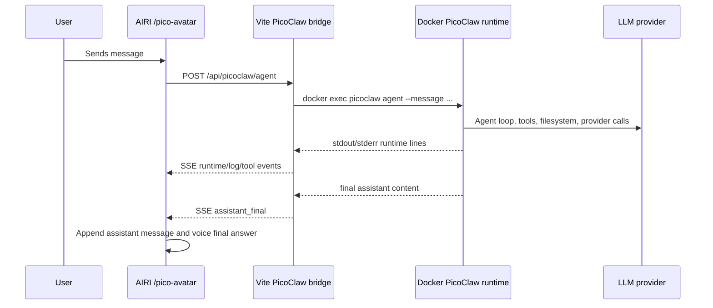

# PicoClaw Avatar Bridge

This document is the system of record for the local AIRI + PicoClaw avatar prototype.

## Purpose

`/pico-avatar` is a local test surface where AIRI provides the visible avatar, speech output, voice input, and runtime UI while PicoClaw performs the actual agent work.

The current prototype now has two response layers:

- a fast front-voice layer for immediate spoken replies and agent handoff
- the real PicoClaw runtime for tool-using work and final agent answers

The current goal is not to recreate all AIRI chat behavior. The goal is to run the real PicoClaw CLI and make only the useful parts visible and audible through AIRI.

## Entrypoints

- AIRI route: `http://localhost:5174/pico-avatar`
- Stage web app: `/Users/velizard/airi-main/apps/stage-web`
- Dev bridge: `/Users/velizard/airi-main/apps/stage-web/src/server/picoclaw-dev-bridge.ts`
- UI page: `/Users/velizard/airi-main/apps/stage-web/src/pages/pico-avatar.vue`
- Fast spoken UI helper: `/Users/velizard/airi-main/apps/stage-web/src/pages/pico-avatar.helpers.ts`
- Persistent PicoClaw home: `/Users/velizard/airi-main/apps/stage-web/.cache/picoclaw-docker-home`
- Patched PicoClaw source: `/Users/velizard/Projects/picoclaw-src`
- Launcher UI: `http://localhost:18800`
- AIRI start script: `/Users/velizard/bin/start-pico-avatar`
- PicoClaw launcher start script: `/Users/velizard/bin/start-picoclaw-launcher`

Do not use or disturb port `5173` for this prototype.

## Launcher Session Notes

The launcher UI on `18800` is PicoClaw's built-in dashboard, not the AIRI bridge. It talks to the PicoClaw gateway over WebSocket, so AIRI bridge SSE events and trace logs do not apply to messages sent directly there.

The local patched launcher uses `PICOCLAW_LAUNCHER_TOKEN` from `/Users/velizard/.config/pico-avatar/openrouter.env`. When this token is set, the patched launcher derives a stable dashboard cookie signing key from that token, so browser login should survive launcher restarts. Random-token mode remains ephemeral and will still require login after restart.

If the launcher asks for login after a restart, use the token from `/Users/velizard/.config/pico-avatar/openrouter.env` or from `docker logs airi-pico-avatar-launcher`.

## All-In-One Container

There is now a local single-container wrapper for the AIRI + PicoClaw stack:

- Compose file: `/Users/velizard/airi-main/docker/pico-avatar-allinone/docker-compose.yml`
- Image name: `local/airi-pico-avatar-allinone:latest`
- Container name: `airi-pico-avatar-allinone`

What it does:

- runs the PicoClaw launcher inside the container on `18800`
- runs AIRI `stage-web` Vite dev server inside the same container on `5174`
- keeps PicoClaw state in `/root/.picoclaw`
- mounts the AIRI repo at `/workspace/airi-main`, so PicoClaw can inspect or edit AIRI code from inside the same container
- uses the bridge in `host` runner mode inside the container by pointing `STAGE_WEB_PICOCLAW_BIN` at `/usr/local/bin/picoclaw`

Run:

```bash
cd /Users/velizard/airi-main/docker/pico-avatar-allinone
docker compose --env-file /Users/velizard/.config/pico-avatar/openrouter.env up --build -d
```

Stop:

```bash
cd /Users/velizard/airi-main/docker/pico-avatar-allinone
docker compose down
```

Notes:

- This wrapper does not touch `5173`.
- It depends on the locally patched PicoClaw launcher base image `local/picoclaw-patched:launcher`.
- PicoClaw home is persisted in the named volume `pico_avatar_home`.
- The AIRI repo is bind-mounted from `/Users/velizard/airi-main` by default; override with `AIRI_REPO=/some/other/path`.

### Operational Contract

- AIRI UI: `http://localhost:5174/pico-avatar`
- PicoClaw launcher: `http://localhost:18800`
- PicoClaw gateway health/backend: `http://localhost:18790`
- The container must be the only thing bound to `5174`, `18800`, and `18790`.
- Port `5173` remains reserved and must not be touched.

### Persistence

- AIRI source comes from the bind mount `/Users/velizard/airi-main -> /workspace/airi-main`.
- PicoClaw state persists in the Docker volume `pico_avatar_home` mounted at `/root/.picoclaw`.
- Linux `node_modules` persist in the Docker volume `pico_avatar_node_modules`.
- The pnpm store persists in the Docker volume `pico_avatar_pnpm_store`.

### First Start Behavior

- The first `docker compose up --build -d` may take a while because the container runs `pnpm install --frozen-lockfile` for the AIRI monorepo inside Linux.
- This is intentional: AIRI uses native optional dependencies, so reusing macOS host `node_modules` inside the Linux container is unreliable.
- The wrapper image includes Python, compiler toolchain, and `canvas` build libraries so native modules are compiled inside the container and do not depend on host macOS binaries.
- Later restarts should be much faster because the container reuses the Linux `node_modules` and pnpm store volumes.

### Logs And Inspection

```bash
cd /Users/velizard/airi-main/docker/pico-avatar-allinone
docker compose logs -f
docker compose ps
docker compose exec airi-pico-avatar-allinone sh
```

Useful in-container paths:

- PicoClaw config: `/root/.picoclaw/config.json`
- PicoClaw workspace: `/root/.picoclaw/workspace`
- Bridge traces: `/root/.picoclaw/bridge-traces`
- AIRI repo: `/workspace/airi-main`

### Upgrade / Rebuild

When AIRI container glue changes:

```bash
cd /Users/velizard/airi-main/docker/pico-avatar-allinone
docker compose up --build -d
```

When the underlying patched PicoClaw images change, rebuild those first, then rebuild this wrapper image.

### Troubleshooting

- If `5174` does not come up quickly on first boot, check `docker compose logs -f`; the most common reason is that `pnpm install` is still running.
- If the launcher login resets after restart, make sure `PICOCLAW_LAUNCHER_TOKEN` is present in `/Users/velizard/.config/pico-avatar/openrouter.env`.
- If OpenRouter requests fail, inspect `/root/.picoclaw/config.json` and confirm the API key was injected into the OpenRouter model entries.
- If PicoClaw writes files, it should prefer `/root/.picoclaw/workspace`; AIRI code access is through `/workspace/airi-main`.

## Runtime Flow



Only `assistant_final` is chat content. Runtime events are UI/diagnostic data.

## Event Contract

The bridge exposes `/api/picoclaw/agent` as server-sent events.

| Event | Meaning | User-visible | Voice output | Append to AIRI chat | Send back to PicoClaw context |
| --- | --- | --- | --- | --- | --- |
| `assistant_final` | Final answer produced by the agent | Yes | Yes | Yes | Yes, as assistant history |
| `visible_status` | Short user-facing progress update emitted by the bridge | Yes | Yes | No | No |
| `runtime` | Structured progress from PicoClaw logs/events | Yes, debug/progress surface | Future optional narration | No | No |
| `log` | Raw-ish non-final logs useful for debugging | Debug only | No | No | No |
| `runtime_status` | Terminal runtime status such as tool-limit reached | Yes, error/status surface | Optional short status | No | No |
| `error` | Bridge or process error | Yes, error surface | No by default | No | No |
| `done` | Stream finished | No | No | No | No |

This invariant is important: user-visible and voice-visible events must not automatically become chat history.

## Trace Logs

Every `/api/picoclaw/agent` request writes a local JSONL trace. These traces exist specifically to debug event-boundary failures where a runtime line is accidentally treated as chat content, or a fallback path does not run when expected.

Default trace directory:

- `/Users/velizard/airi-main/apps/stage-web/.cache/picoclaw-bridge-logs`

Latest trace pointer:

- `/Users/velizard/airi-main/apps/stage-web/.cache/picoclaw-bridge-logs/latest.txt`

Each trace records:

- monotonic `seq` numbers for event ordering
- selected provider/model/config source
- message length and short prompt preview
- parsed PicoClaw runtime/log/final candidates
- whether a final candidate was classified as `runtime_status`
- fallback decision and blocked reason
- SSE events emitted to the browser
- process close code/signal and output tail

Secrets are redacted before writing. These traces are local dev diagnostics and should not be committed.

Useful inspection commands:

```bash
latest=$(cat /Users/velizard/airi-main/apps/stage-web/.cache/picoclaw-bridge-logs/latest.txt)
tail -n 80 "$latest"
rg '"event":"primary_close"|"event":"cli_final_candidate"|"event":"sse_emit"' "$latest"
```

## Context Boundary

PicoClaw has its own session history. AIRI also has a browser-side chat transcript. The bridge is the boundary between runtime telemetry and conversational messages.

Rules:

- Only final assistant answers should be persisted as assistant chat messages.
- Runtime progress, tool logs, process errors, rate-limit fallback notices, and status messages must stay out of LLM context.
- If a new event should be narrated by AIRI, add a typed event for it instead of reusing `assistant_final`.
- If a new event should affect the next LLM turn, make that explicit and document why.

## Previous Bug: Tool-Limit Status Became Assistant Context

The observed failure was caused by three layers doing exactly what their local code said, but with the wrong boundary:

1. PicoClaw created the `max_tool_iterations` status as final assistant content.
2. The bridge parsed any `🦞 ...` line as `assistant_final`.
3. AIRI appended every `assistant_final` to browser chat history.

Result: a runtime status became prior assistant conversation, so later model turns treated it as chat context instead of infrastructure state.

Current fix:

- PicoClaw patch: `/Users/velizard/Projects/picoclaw-src/pkg/agent/loop_turn.go` still returns the tool-limit status to the caller, but does not persist it into PicoClaw session history.
- Bridge patch: `picoclaw-dev-bridge.ts` maps tool-limit statuses and terminal `Error processing message:` failures to `runtime_status`, not `assistant_final`.
- UI patch: `pico-avatar.vue` logs/displays `runtime_status` and does not append it to AIRI chat history.

Do not reintroduce this as a prompt workaround. The fix belongs at the event boundary.

## Fast Front Layer

`/api/picoclaw/fast` is a dev-only streaming endpoint used before PicoClaw starts.

It takes:

- the user message
- the current AIRI roleplay/system prompt

It returns a short spoken reply where:

- plain text means "this is the final fast reply"
- a first-line prefix `[agent]` means "speak this short handoff reply, then start PicoClaw"

This first fast reply is intentionally ephemeral on the agent path. It is spoken and shown live, but it is not appended to chat history when PicoClaw takes over.

## Visible Narration

The bridge now emits a separate `visible_status` stream: short user-facing status lines that AIRI can speak while PicoClaw is working.

Examples:

- "Looking through the workspace."
- "Installing dependencies in the container."
- "Starting the dev server on port 8080."
- "The selected OpenRouter model is rate-limited, switching to a free fallback."

In v1 these lines are rule-based and derived from existing PicoClaw runtime/log lines. They are intentionally simple and sparse:

- start working
- inspect files/code
- found something useful
- blocker / retry / rate limit
- result ready

This event is separate from `assistant_final`, so narration stays out of chat history and out of future model context.

The next useful layer after this is an optional LLM-based rewriter that can turn these coarse statuses into higher-quality roleplay narration without changing the event boundary.

That future rewriter should still sit on top of `visible_status`, not replace the typed event contract.

Example payload:

```json
{
  "text": "Starting the dev server on port 8080.",
  "voice": true,
  "severity": "info",
  "source": "tool"
}
```

Required behavior:

- Display in the runtime/progress UI.
- Optionally speak through AIRI TTS.
- Never append to chat history by default.
- Never send back as a user or assistant message by default.
- Keep concise; these are stage directions, not assistant answers.

If a narration line should become part of final answer reasoning, the agent should summarize that in `assistant_final` itself.

## Docker Runtime Notes

The PicoClaw runtime is intentionally long-lived and has full access inside its container.

- Container name: `airi-pico-avatar`
- Image: `local/picoclaw-patched:latest`
- Persistent home mount: `/Users/velizard/airi-main/apps/stage-web/.cache/picoclaw-docker-home:/root/.picoclaw`
- Host-exposed port ranges: `3000-3010`, `4173-4175`, `8000-8010`, `8080-8090`

When PicoClaw starts a server inside the container, it must bind to `0.0.0.0` and use one of the mapped ports. Then the host can open it as `http://localhost:<port>`.

## OpenRouter Free-Model Fallback

The patched PicoClaw provider fallback lives in:

- `/Users/velizard/Projects/picoclaw-src/pkg/providers/fallback.go`
- `/Users/velizard/Projects/picoclaw-src/pkg/agent/loop_turn.go`

For OpenRouter free-class models such as `*:free` and `elephant-alpha`, provider-side `429` responses append a native fallback chain of concrete free models, then `openrouter/free` as the last router fallback.

This is intentionally inside PicoClaw rather than only in the AIRI bridge. The bridge may still show the fallback as runtime/narration data, but provider retry policy belongs in PicoClaw. The agent loop must call the fallback chain for a single OpenRouter free-class primary too; otherwise dynamic fallback injection never runs.

## Verification

Useful checks:

```bash
curl -sS http://localhost:5174/api/picoclaw/status
curl -sSI http://localhost:18800
docker ps --format '{{.Names}} {{.Image}} {{.Status}} {{.Ports}}' | rg 'airi-pico-avatar'
pnpm -F @proj-airi/stage-web typecheck
```

PicoClaw source checks:

```bash
cd /Users/velizard/Projects/picoclaw-src
go test ./pkg/agent/...
go test ./pkg/providers/...
```
